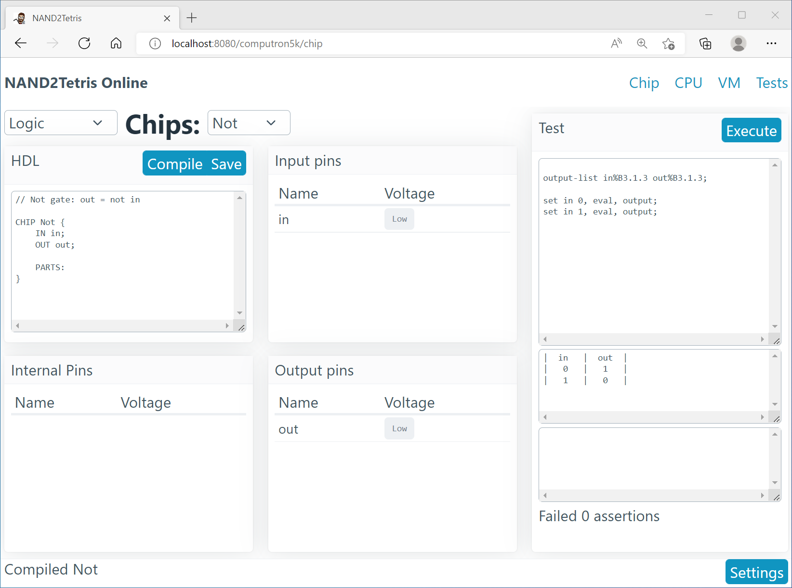
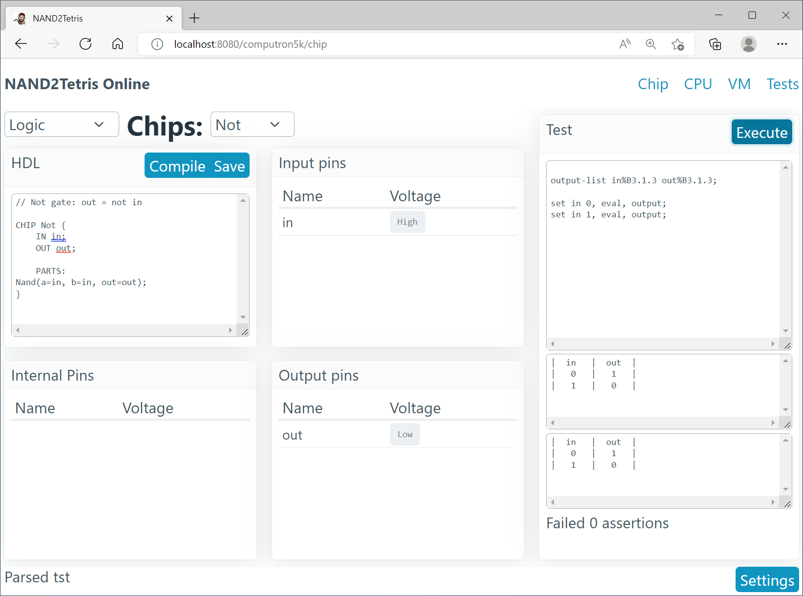
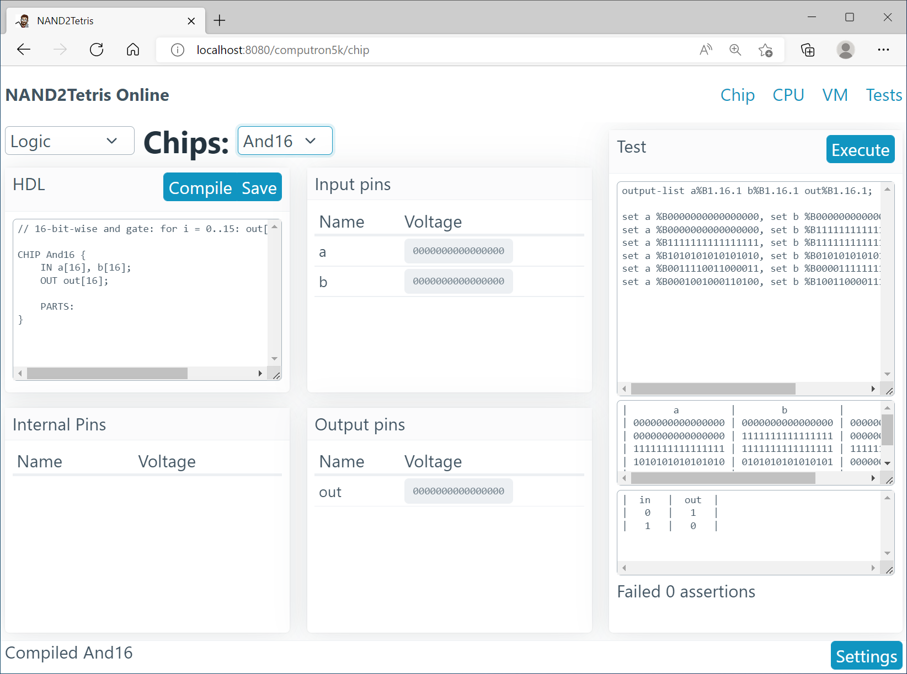

# NAND2Tetris Web User Guide

This web application implements the [NAND2Tetris](https://nand2tetris.org) software suite, including an hdl chip simulator, a hack CPU, and a Hack VM.
Students are able to paste their implementations of the various chips and programs

## Chip Simulator

The chip page has five panels, as well as a project selction bar.
In the top left, users can input the text of their HDL chip.
The top center panel displays the chip's input pins, and the bottom center the output pins.
The bottom left panel has any internal pins in the chip.
The right panel includes the test program, the expected comparison output, and after executing the test, the test output and a diff of failed lines.

---

The project selection bar loads the chip HDL outlines, tests, and cmp files from the book.
After choosing the "Not" chip, the input and output pins update.
After implementing the chip and clicking "Compile", clicking the input pin buttons will toggle their voltage states.
The output pins will update with the simulated state from the hdl spec.

---

Loading a chip with a 16-bit bus changes the pin panels to show a binary representation of the chip.

---

Clicking an input bus will increment that bus by one.

---

Clicking "Execute" will run the test against the chip implementation.
Any failing tests will be put in the bottom of the panel, with a diff between the expected and actual output.
You may need to scroll to see all failed lines.

---

All tests pass!

---

Clicking `Save` in the HDL panel will store the HDL chip to user's local storage.
In settings, clicking `Files: Reset` will restore the files to the book' projects.
